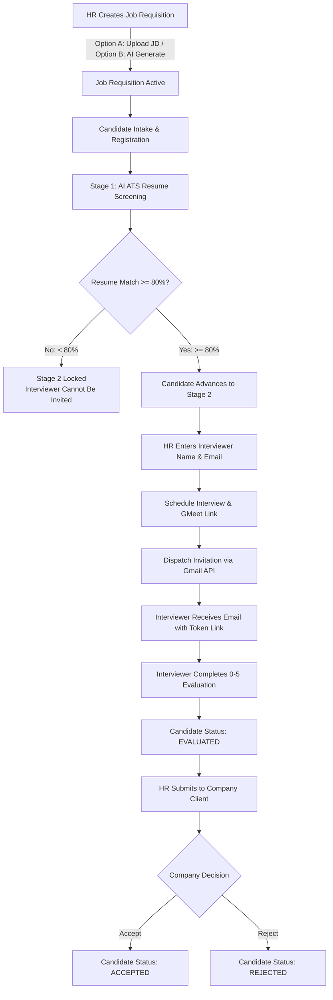

# RecruitFlow — AI-Powered Talent Acquisition & Technical Evaluation Platform

RecruitFlow is an enterprise recruitment management platform designed to automate and streamline the full candidate lifecycle: from AI-driven job requisition creation and instant ATS resume screening, to 80% threshold Stage 2 gating, manual interviewer email assignment, automated Gmail invitation dispatch, and a dedicated token-secured Technical Evaluator Portal.

---

## Table of Contents
1. [Platform Architecture & Portals](#platform-architecture--portals)
2. [End-to-End Recruitment Workflow](#end-to-end-recruitment-workflow)
3. [Stage 1 vs. Stage 2 Gating Rule (80% Match)](#stage-1-vs-stage-2-gating-rule-80-match)
4. [Complete UI Elements & Component Catalog](#complete-ui-elements--component-catalog)
   - [HR Portal UI Details](#1-hr-recruiter-portal)
   - [Technical Evaluator Portal UI Details](#2-technical-evaluator-portal-token-based)
   - [Company Client Portal UI Details](#3-company-client-portal)
5. [Database Schema & Data Models](#database-schema--data-models)
6. [Technology Stack](#technology-stack)
7. [Environment & Configuration](#environment--configuration)

---

## Platform Architecture & Portals

RecruitFlow is architected with three distinct access surfaces:

```
                                  +-----------------------------+
                                  |         RecruitFlow         |
                                  +-----------------------------+
                                                 |
         +---------------------------------------+---------------------------------------+
         |                                       |                                       |
+------------------+                   +--------------------+                  +--------------------+
|    HR Portal     |                   |  Evaluator Portal  |                  |   Company Portal   |
|     (/hr/*)      |                   | (/evaluation/:tok) |                  |    (/company/*)    |
+------------------+                   +--------------------+                  +--------------------+
| • Job Studio     |                   | • Token-Gated Auth |                  | • Candidate Review |
| • Candidate Pool |                   | • Resume Preview   |                  | • Evaluator Scores |
| • AI ATS Screen  |                   | • 0-5 Skill Scores |                  | • Final Hiring     |
| • 80% Stage 2    |                   | • Interview Notes  |                  |   Decisions        |
| • Gmail Dispatch |                   | • Lock & Submit    |                  |   (Accept/Reject)  |
+------------------+                   +--------------------+                  +--------------------+
```

1. **HR Recruiter Portal (`/hr/...`)**: Primary dashboard for talent recruiters to post positions, ingest candidates, run automated resume screening, assign interviewers, schedule interviews with Google Meet, and dispatch invitations via Gmail.
2. **Guest Technical Evaluator Portal (`/evaluation/[token]`)**: Secure, passwordless portal accessible only via a cryptographically signed token sent to the interviewer's email. Contains live resume viewing, 0–5 skill scoring rubrics, and feedback capture.
3. **Company Client Portal (`/company/...`)**: Client portal where company stakeholders review technical evaluation scores, interview notes, and make final hiring decisions (Accept / Reject).

---

## End-to-End Recruitment Workflow



### Step 1: Role Creation & AI Job Description Studio (`/hr/jobs/create`)
- **Option 1: Parse Existing JD (Document / Paste)**: HR uploads a `.pdf` or `.docx` document or pastes raw text. The Groq AI engine extracts job title, department, experience, required skills, and synthesizes a single continuous overview paragraph.
- **Option 2: Generate with AI**: HR provides basic parameters (title, experience years, department, location). Groq AI automatically constructs production-grade job requirements, responsibilities, and competencies.
- **AI Description Auto-Enhancement**: HR can freely add or type notes in the description textarea and click **"✨ Regenerate Description"**. The AI incorporates newly added notes into the description without deleting text or resetting content.

### Step 2: Candidate Intake & Registration
- Candidates are enrolled through the **Add Candidate Modal** or the `/hr/candidates/create` page.
- Required fields: Full Name, Email, Phone, Job Assignment, and Resume URL / Text.
- *No tech lead or interviewer assignment is requested or required upfront.*

### Step 3: Stage 1 — Automated AI Resume Screening
- Upon registration or clicking **"Evaluate"**, Groq AI (`openai/gpt-oss-20b`) evaluates the resume against the Job Description.
- Produces:
  - **ATS Match Score** (0–100%)
  - **Matched Skills List** (skills found in both resume and JD)
  - **Missing Skills List** (required competencies not demonstrated)
  - **Candidate Strengths** (top highlights)
  - **Recommendation** (`STRONG_MATCH`, `MODERATE_MATCH`, `POOR_MATCH`)
  - **Technical Summary Assessment** (2–3 sentence breakdown)
- Response time is optimized to under 1 second (~770ms).

### Step 4: Stage 2 Gating Rule ($\ge 80\%$ Threshold)
- **Strict Requirement**: A candidate profile can advance to **Stage 2 (Technical Interview)** only if:
  $$\text{AI ATS Match Percentage} \ge 80\% \quad \text{AND} \quad \text{Recommendation} \neq \text{'POOR\_MATCH'}$$
- **If Match $< 80\%$**:
  - The **"Send Mail"** button is completely hidden from candidates table and card views.
  - The Interviewer Email field cannot be updated (`400 Bad Request` returned if attempted).
  - The Stage 2 panel displays a prominent amber lock banner: *"Stage 2 Locked: Candidate resume match score is below the 80% threshold required to invite an interviewer."*
- **If Match $\ge 80\%$**:
  - Profile unlocks Stage 2 with a green badge: `Ready for Stage 2`.
  - The **"Send Mail"** button is visible and active.
  - HR can manually assign the interviewer's name and work email.

### Step 5: Interviewer Assignment & Gmail Dispatch
- Clicking **"Send Mail"** opens the dedicated popup modal.
- HR fills in:
  - **Interviewer Full Name** (e.g. `Sarah Jenkins (Senior Architect)`)
  - **Interviewer Work Email** (e.g. `sarah.jenkins@company.com`)
- System creates a cryptographic invitation token (valid for 7 days).
- Dispatches a formatted invitation email through the **Google OAuth2 / Gmail API** with:
  - Role details & candidate name
  - Direct clickable evaluation portal link (`http://localhost:3000/evaluation/<token>`)
  - Scheduled interview date, time, and Google Meet URL (if pre-configured)
  - PDF candidate resume attachment.

### Step 6: Technical Interview & Evaluation Portal (`/evaluation/[token]`)
- Interviewer clicks the link in their email and lands directly on the evaluation portal without needing a RecruitFlow account.
- **In-App Resume Viewer**: Interviewer can review the candidate's PDF resume in a modal.
- **Rubric Guidance (0 to 5)**:
  - `0`: No Knowledge
  - `1`: Novice
  - `2`: Elementary
  - `3`: Competent
  - `4`: Proficient
  - `5`: Expert
- **Skill-by-Skill Scoring**: Interviewer scores every required technical skill from 0 to 5.
- **Interview Notes**: Qualitative feedback, architectural observations, and strengths/weaknesses.
- **Final Recommendation**: `STRONG_HIRE`, `HIRE`, `BORDERLINE`, or `REJECT`.
- Once submitted, the portal locks permanently and syncs live scores to the HR dashboard.

### Step 7: Submission to Company Client & Final Decision
- HR reviews the completed evaluation and clicks **"Submit to Company"**.
- Candidate status transitions to `SUBMITTED_TO_COMPANY`.
- Company stakeholders view the candidate on the Company Portal (`/company/candidates/[id]`), review technical scores and interviewer notes, and render a final hiring decision: **Accept** or **Reject**.

---

## Stage 1 vs. Stage 2 Gating Rule (80% Match)

| Feature | Match Score $< 80\%$ (Stage 1 Only) | Match Score $\ge 80\%$ (Stage 2 Qualified) |
| :--- | :--- | :--- |
| **Pipeline Stage** | Stage 1: Screening | Stage 2: Technical Interview |
| **Status Indicator** | `Stage 2 Locked (<80%)` (Amber badge) | `Ready for Stage 2` (Emerald badge) |
| **"Send Mail" Button** | **Hidden** | **Visible & Clickable** |
| **Interviewer Assignment** | Locked (`400 Bad Request` if attempted) | Unlocked (Manual email & name entry) |
| **Invitation Link Generation** | Disabled | Enabled (Cryptographic token created) |
| **Schedule Interview Modal** | Locked with requirement banner | Fully accessible with GMeet link generator |
| **Gmail Invitation Dispatch** | Blocked | Dispatches via Google OAuth2 / Gmail API |

---

## Complete UI Elements & Component Catalog

### 1. HR Recruiter Portal

#### 1.1 Navigation Bar & Top Header
- **Logo & Wordmark**: "RecruitFlow" with brand gradient icon.
- **Active Navigation Links**:
  - `Dashboard` (`/hr/dashboard`)
  - `Jobs` (`/hr/jobs`)
  - `Candidates` (`/hr/candidates`)
  - `Evaluations` (`/hr/evaluations`)
  - `Settings` (`/hr/settings`)
- **User Profile Pill**: Recruiter name, role pill (`HR`), and **Logout** button.

#### 1.2 HR Dashboard (`/hr/dashboard`)
- **Metric Cards (Top Row)**:
  - *Total Candidates*: Total talent records with growth indicator.
  - *Open Requisitions*: Active job postings accepting candidates.
  - *Evaluated Profiles*: Candidates with completed technical assessments.
  - *Accepted Hires*: Candidates hired by client companies.
- **Interactive Radial Funnel**: 36-segment color ring showing pipeline distribution (Screening, Evaluated, Accepted, Open).
- **Time Velocity Filters**: Filter metric calculations by `Weekly`, `Monthly`, or `Quarterly`.
- **Department Demand Breakdown**: Bar chart toggling between department demand and requisition status.
- **Recent Candidate Activity Table**: Real-time log of applicants, match percentages, and actions.

#### 1.3 Candidates Directory (`/hr/candidates`)
- **Header Actions**:
  - Search Input: Real-time filtering by candidate name, email, or skill.
  - Job Filter Dropdown: Filter candidates by requisition.
  - Status Tabs: `All`, `Screening`, `Evaluated`, `Submitted`, `Accepted`, `Rejected`.
  - **"+ Add Candidate" Button**: Triggers `AddCandidateModal`.
  - **"Refresh" Button**: Re-fetches database and recalculates screening matches.
- **Candidate Data Table (Desktop)**:
  - *Candidate Column*: Avatar, Full Name, Email, Phone.
  - *Assigned Job Column*: Job Title, Department tag.
  - *Stage 2 Status Column*:
    - If interviewer assigned: Shows assigned interviewer email with badge.
    - If match $\ge 80\%$: Emerald badge `Ready for Stage 2`.
    - If match $< 80\%$: Muted slate badge `Stage 2 Locked (<80%)`.
  - *Score & Status Column*: Workflow status badge (`SCREENING`, `EVALUATED`, etc.) and ATS Match percentage badge (`getMatchScoreBadge`: $\ge 80\%$ emerald, $70\text{--}79\%$ blue, $50\text{--}69\%$ amber, $<50\%$ rose).
  - *Actions Column*:
    - **"View" Button** (`/hr/candidates/[id]`): Opens full candidate profile.
    - **"Evaluate" Button** (`/hr/candidates/[id]/screening`): Opens AI screening deep-dive.
    - **"Send Mail" Button** (*Gated: visible ONLY when match $\ge 80\%$*): Opens `SendMailModal` to enter interviewer name & email.
    - **Edit Icon**: Opens `EditCandidateModal`.
    - **Trash Icon**: Opens deletion confirmation prompt.
- **Mobile Card View**: Responsive card layout maintaining identical gating and action buttons for small screens.

#### 1.4 Add Candidate Modal (`AddCandidateModal.js`)
- **Candidate Name Input**: Full name with character validation.
- **Email Address Input**: Validated email format.
- **Phone Number Input**: Contact number.
- **Assigned Job Dropdown**: Populated with all active `OPEN` job requisitions.
- **Resume URL Input**: Direct link to PDF/DOCX resume file.
- **Resume Text Area**: Optional raw text paste for instant parsing.
- **Skills Input**: Comma-separated technical skills.
- **Footer**: Cancel and **"Save & Screen Candidate"** buttons.

#### 1.5 Send Mail Modal (`SendMailModal.js`)
- **Header**: Icon, title, and close button.
- **Candidate Overview Card**: Displays candidate name, job title, and ATS Match score pill.
- **Interview Details Banner** *(visible if scheduled)*: Displays confirmed date, time, and Google Meet link.
- **Stage 2 Gating Form**:
  - *If Match $\ge 80\%$*:
    - **Interviewer Full Name Input**: Text field (e.g. `Sarah Jenkins (Senior Architect)`).
    - **Interviewer Email Address Input**: Required email field (e.g. `interviewer@company.com`).
    - Informational caption explaining Gmail API dispatch.
  - *If Match $< 80\%$*:
    - **Locked Banner**: Amber warning indicating profile scored below the 80% threshold required to invite an interviewer.
- **Evaluation Link Preview** *(if invitation created)*: Read-only copyable URL with **"Copy Link"** button.
- **Footer Actions**:
  - Cancel / Done button.
  - **"Send Invitation Email" Button** *(active only when match $\ge 80\%$ and email entered)*: Triggers backend dispatch via Gmail API.

#### 1.6 Candidate Details Page (`/hr/candidates/[id]`)
- **Card 1: Profile & Resume Overview**: Contact details, resume download/preview, assigned requisition.
- **Card 2: Stage 1 AI Screening Results**: Match score meter, recommendation pill, matched vs. missing skills tags.
- **Card 3: Technical Interviewer Assignment**:
  - If match $< 80\%$: Locked amber banner (*Resume Match $\ge 80\%$ Required*).
  - If match $\ge 80\%$ & unassigned: Inline email input with **"Save"** button.
  - If assigned: Displays interviewer email, assignment badge, and **"Change"** button.
- **Card 4: Stage 2 Technical Interview & Evaluation Portal**:
  - Locked state when match $< 80\%$.
  - Unlocked state when match $\ge 80\%$:
    - **"Schedule Interview" Button**: Opens `ScheduleInterviewModal`.
    - **"Send Invitation Email" / "Resend Invitation" Button**: Dispatches invite via Gmail.
    - Active invitation status badge (`PENDING`, `COMPLETED`, `EXPIRED`).
- **Card 5: Client Company Submission**: Button to submit evaluated profile to client company.

#### 1.7 Schedule Interview Modal (`ScheduleInterviewModal.js`)
- **Interview Date Picker**: Date input for interview call.
- **Interview Time Picker**: Time input.
- **Google Meet Link Input**: Direct URL or **"Generate Google Meet"** auto-filler.
- **Interviewer Email Input**: Confirms recipient email address.
- **Submit Button**: Saves schedule and updates candidate record.

#### 1.8 Job Creation Studio (`/hr/jobs/create`)
- **Mode Toggle**:
  - *Tab 1: "With Job Description"* (File upload `.pdf`/`.docx` dropzone or text paste area).
  - *Tab 2: "Generate with AI"* (Job title, experience years, department, location inputs).
- **Draft Preview & Editor**:
  - Role Title, Department, Seniority Level, Experience Required, Location inputs.
  - **Job Description Overview Textarea**:
    - **"✨ Regenerate Description" Button**: Calls Groq AI to enhance and synthesize draft notes into a single cohesive paragraph without deleting user content.
  - **Required Skills Chip Manager**: Interactive tags list with add/remove buttons.
  - **Responsibilities & Qualifications Lists**: Bullet point managers.
  - **"Publish Job Requisition" Button**: Commits job to database.

---

### 2. Technical Evaluator Portal (Token-Based)
**Route**: `/evaluation/[token]`

- **Authentication Guard**: Validates cryptographic token; returns error state if token is expired, completed, or invalid.
- **Evaluator Welcome Banner**: Displays candidate name, job title, and evaluator greeting.
- **Candidate Snapshot Card**:
  - Name, Requisition, and Experience level.
  - **"View Candidate Resume" Button**: Opens modal overlay with full resume text/PDF.
- **Rubric Guidance Drawer**:
  - Expandable drawer with scoring definitions for grades 0 through 5.
- **Skill-by-Skill Evaluation Cards**:
  - For each required skill: Title, description, and interactive 0–5 button group.
  - Selected scores highlight with color coding (0: gray, 1: rose, 2: amber, 3: sky, 4: indigo, 5: emerald).
- **Interview Observations Textarea**: Multi-line feedback box for detailed interview notes.
- **Overall Recommendation Pill Selector**:
  - `STRONG_HIRE` (Emerald)
  - `HIRE` (Blue)
  - `BORDERLINE` (Amber)
  - `REJECT` (Rose)
- **Submit Evaluation Button**: Validates all skills are scored, submits evaluation, and locks page into immutable confirmation view.

---

### 3. Company Client Portal

#### 3.1 Company Dashboard (`/company/dashboard`)
- Requisitions overview and applicant pipeline counters (Pending, Accepted, Rejected).
- Quick-access list of candidates submitted by HR for client review.

#### 3.2 Candidate Evaluation Review (`/company/candidates/[id]`)
- **Candidate Summary**: Name, contact, resume link.
- **Technical Evaluation Summary**:
  - Overall evaluation score out of 5.0.
  - Technical Interviewer email / name attribution.
  - Skill-by-skill score table showing individual scores out of 5.
  - Interviewer feedback notes & observations.
- **Hiring Decision Action Bar**:
  - **"Accept Candidate" Button**: Marks candidate as `ACCEPTED` with hire timestamp.
  - **"Reject Candidate" Button**: Marks candidate as `REJECTED`.
  - Confirmation modal protecting against accidental clicks.

---

## Database Schema & Data Models

```
+------------------+         +-------------------+         +------------------------+
|      users       |         |       jobs        |         |       candidates       |
+------------------+         +-------------------+         +------------------------+
| id (PK)          |         | id (PK)           |         | id (PK)                |
| name             |         | title             |         | name                   |
| email            |         | department        |         | email                  |
| password         |         | description       |         | phone                  |
| role (HR/COMPANY)|         | required_skills   |         | resume_url             |
| created_at       |         | experience_req    |         | resume_text            |
+------------------+         | location          |         | ai_match_percentage    |
                             | status            |         | ai_screening_details   |
                             | hr_id (FK->users) |         | interviewer_email      |
                             +-------------------+         | interview_date/time    |
                                                           | gmeet_link             |
                                                           | status                 |
                                                           | job_id (FK->jobs)      |
                                                           +------------------------+
                                                                       |
                             +-----------------------------------------+
                             |
+------------------------------------+         +-------------------------------------+
|       interview_invitations        |         |        interview_evaluations        |
+------------------------------------+         +-------------------------------------+
| id (PK)                            |         | id (PK)                             |
| candidate_id (FK->candidates)      |         | candidate_id (FK->candidates)       |
| token (UNIQUE, crypto)             |         | job_id (FK->jobs)                   |
| interviewer_email                  |         | interviewer_email                   |
| interviewer_name                   |         | overall_score (0-5)                 |
| evaluation_url                     |         | recommendation                      |
| status (PENDING/COMPLETED/EXPIRED) |         | notes                               |
| expires_at                         |         | submitted_at                        |
+------------------------------------+         +-------------------------------------+
                                                                  |
                                               +-------------------------------------+
                                               |     interview_evaluation_skills     |
                                               +-------------------------------------+
                                               | id (PK)                             |
                                               | evaluation_id (FK->evaluations)     |
                                               | skill_name                          |
                                               | score (0-5)                         |
                                               +-------------------------------------+
```

> **Note**: The legacy `tech_leads` table was permanently dropped from the database. Interviewer email addresses are stored directly on the `candidates`, `interview_invitations`, and `interview_evaluations` records.

---

## Technology Stack

### Frontend
- **Framework**: Next.js 16 (App Router with Turbopack)
- **Language**: JavaScript / React 19
- **Styling**: TailwindCSS & Vanilla CSS design tokens
- **Icons**: Lucide React
- **HTTP Client**: Axios with centralized request interceptors
- **Typography**: Inter / Outfit modern sans-serif

### Backend
- **Framework**: NestJS 10 (Node.js)
- **Language**: TypeScript
- **Database ORM**: TypeORM
- **Relational Database**: PostgreSQL (Supabase pooler)
- **AI Engine**: Groq SDK (`openai/gpt-oss-20b` — ~770ms latency)
- **Email Service**: Google APIs (OAuth2 + Gmail REST API)
- **Document Parser**: `pdf-parse`, `mammoth` (Word DOCX), PDFKit

---

## Environment & Configuration

### Backend Environment Variables (`backend/.env`)
```ini
PORT=5000
FRONTEND_URL=http://localhost:3000

# PostgreSQL Database (Supabase)
DB_HOST=aws-0-ap-southeast-2.pooler.supabase.com
DB_PORT=5432
DB_USERNAME=postgres.afvpgqzskdkfkidbrozn
DB_PASSWORD=RecruitFlow@Hari
DB_DATABASE=postgres

# Groq AI Provider (Fast 20B Model)
GROQ_API_KEY=gsk_...
GROQ_MODEL=openai/gpt-oss-20b

# Google OAuth2 Gmail API
GOOGLE_CREDENTIALS_PATH=./credentials.json
GOOGLE_TOKEN_PATH=./token.json
GOOGLE_REDIRECT_URI=http://localhost:5000/api/email/gmail/callback
```

### Frontend Environment Variables (`frontend/.env.local`)
```ini
NEXT_PUBLIC_API_URL=http://localhost:5000/api
```

---

## Running the Application Locally

1. **Start the Backend Server**:
   ```bash
   cd backend
   npm install
   npm run start:dev
   ```
   The backend runs on `http://localhost:5000`.

2. **Start the Frontend Application**:
   ```bash
   cd frontend
   npm install
   npm run dev
   ```
   The frontend runs on `http://localhost:3000`.

3. **Log in with Seed Credentials**:
   - **HR Recruiter**: `hr@recruitment.com` / `hr123`
   - **Company Client**: `contact@techcorp.com` / `company123`
